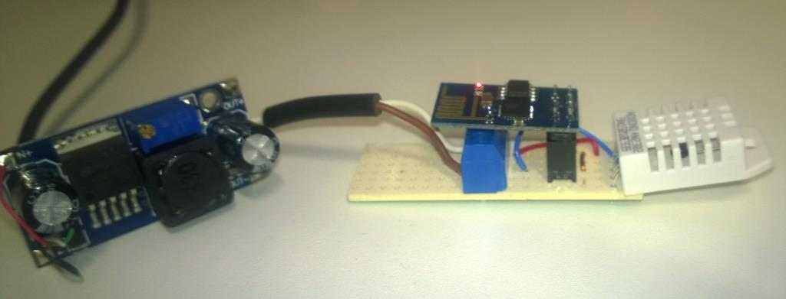

# NodeMCU2KNX_OnLogicMachine
NodeMCU to KNX trough the RemoteService on Logic Macine 

Overview
========
This is a early DIY project on how I built an external temperature (and humidity) sensor to extend my KNX installation. The actual interface between the NodeMCU and KNX Bus in this project, is a Logic Macine (LM3) from [Embedded Systems](http://openrb.com/).
On the LM i'm using the RemoteService by posting a json- style message. 

Components
========
Besides the Logic Machine unit from Embedded Systems (as stated above), you need only two components for this project:
- DHT22 Temperature and Humidity sensor
- ESP-01 (Wifi module ESP8622 by Espressif)

To flash, and load the provided Lua code, you will be using a USB TTL module with the option to supply 3.3V

Flash ESP-01 with custom build firmware
========
Follow this link to learn the basics of installing (flashing) NodeMCU for the ESP-01. [http://benlo.com/esp8266/esp8266QuickStart.html] (http://benlo.com/esp8266/esp8266QuickStart.html)

I recommend using the ESPlorer IDE. Latest version is available at [http://esp8266.ru/esplorer/] (http://esp8266.ru/esplorer/)

After many hours of struggling with "out of memory" and inaccurate DHT22 readings, I found this great site for 
custom firmware builds. [http://frightanic.com/nodemcu-custom-build/] (http://frightanic.com/nodemcu-custom-build/)

For this project I am using a built against the master branch that includes the following modules: **node, file, gpio, wifi, net, tmr, uart, crypto, dht**. You should use the Integer firmware together with the provided Lua- code.


Putting in all together
========

When the ESP-01 has successfully been flashed with a custom build firmware, you may build a breadboard prototype.

1. Breadboard prototype:


2. Modify source files 

In the *init_startup.lua* change these values  to local configuration

``` 
WIFI_SSID = "MySSID"    
WIFI_PASS = "MyWiFiPass"
```

- In the *IoT_DHT22.lua* change these values  to local configuration

``` 
TEMP_OBJ_ADR         = "1/1/14"         -- Group Address (GA) of Temperature object
HUMI_OBJ_ADR         = "1/1/15"         -- Group Address (GA) of Humidity object
SCADA_REMOTE_IP      = "192.168.1.123"  -- IP of LM
SCADA_AUTH_USR_PASS  = "remote:remote"  -- [UserName:Password] or LM remote service

```

3. Deploying a node

This i a suggestion on how to implement on a 3 row perfboard (DOT PCB)


Final result migth look somthing like this


This is powered by a USB power source with a (oversize) Step Down Module Buck Converter. 

### To-Do: 
- Battery power
- 3D printed casing to enhance WAF

